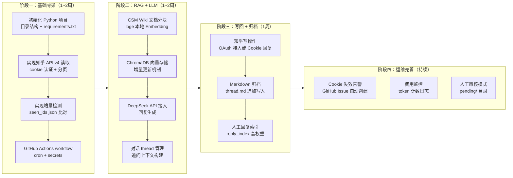

# 实施方案与计划

> 基于 `docs/调研/` 所有调研报告，本文档给出详细实施方案、流程图及 AI 编程提示。

---

## 一、系统逻辑流程图

```mermaid
flowchart TD
    A([GitHub Actions 定时触发\n每6小时]) --> B[拉取最新代码\n加载 seen_ids.json]
    B --> C{CSM Wiki\n是否有更新?}
    C -- 是 --> D[增量更新向量库\n只处理变更文件]
    C -- 否 --> E[跳过]
    D --> E
    E --> F[遍历监控文章列表\nconfig/articles.yaml]
    F --> G[调用知乎 API v4\nGET /articles/{id}/comments]
    G --> H{有新评论?}
    H -- 否 --> Z([本次结束\ngit push 状态])
    H -- 是 --> I{是追问?\n检查 parent_id}
    I -- 新对话 --> J[创建新 thread.md\n抓取文章摘要]
    I -- 追问 --> K[加载已有 thread.md\n获取历史上下文]
    J --> L[RAG 检索\n1. reply_index 真人回复\n2. CSM Wiki 相关片段]
    K --> L
    L --> M[组装 Prompt\nSystem: 角色+规则+Wiki\nHistory: 历史轮次\nUser: 当前评论]
    M --> N[调用 DeepSeek-V3 API\nmax_tokens=250]
    N --> O{人工审核模式\n开启?}
    O -- 是 --> P[写入 pending/\n等待人工确认]
    O -- 否 --> Q[调用知乎 API\nPOST /comments\n发布回复]
    P --> R[追加到 thread.md\n更新 seen_ids.json]
    Q --> R
    R --> S[真人是否有新回复?]
    S -- 是 --> T[写入 thread.md ⭐\n索引到 reply_index]
    S -- 否 --> U
    T --> U[git add + commit\n推送归档 skip-ci]
    U --> Z
```

---

## 二、实施流程图（阶段性计划）



---

## 三、目录结构设计

```
Zhihu-CSM-Reply-Robot/
├── .github/workflows/
│   ├── bot.yml              # 主 workflow：每6小时检查回复
│   └── sync-wiki.yml        # 每周同步 CSM Wiki
├── config/
│   ├── articles.yaml        # 监控的知乎文章/问题列表
│   └── settings.yaml        # 全局配置（模型、k值、审核模式等）
├── scripts/
│   ├── run_bot.py           # 主入口
│   ├── zhihu_client.py      # 知乎 API 封装
│   ├── rag_retriever.py     # ChromaDB + BGE embedding
│   ├── llm_client.py        # DeepSeek/OpenAI 调用封装
│   ├── thread_manager.py    # 对话线程管理
│   ├── archiver.py          # 归档写入
│   └── wiki_sync.py         # CSM Wiki 增量同步
├── csm-wiki/                # CSM Wiki Markdown 文件（子模块或直接放置）
├── data/
│   ├── seen_ids.json
│   ├── wiki_hash.json
│   ├── vector_store/        # ChromaDB Wiki 索引
│   └── reply_index/         # ChromaDB 历史回复索引
├── archive/
│   └── articles/
│       └── {article_id}/
│           ├── meta.md
│           └── threads/
│               └── {thread_id}.md
├── pending/                 # 人工审核模式：待确认回复
├── requirements.txt
└── README.md
```

---

## 四、关键配置文件格式

### config/articles.yaml

```yaml
articles:
  - id: "98765432"
    title: "CSM 最佳实践系列（一）"
    url: "https://zhuanlan.zhihu.com/p/98765432"
    type: "article"   # article | question
  - id: "123456789"
    title: "如何做好客户成功？"
    url: "https://www.zhihu.com/question/123456789"
    type: "question"

settings:
  check_interval_hours: 6
  max_new_comments_per_run: 20   # 每次最多处理20条，防止异常
```

### config/settings.yaml

```yaml
llm:
  base_url: "https://api.deepseek.com"
  model: "deepseek-chat"
  fallback_model: "deepseek-reasoner"   # 复杂问题升级
  max_tokens: 250
  temperature: 0.7

rag:
  embedding_model: "BAAI/bge-small-zh-v1.5"  # 本地模型
  top_k: 3
  similarity_threshold: 0.72
  history_turns: 6   # 追问时保留最近N轮

review:
  manual_mode: false   # true = 写入 pending/，不自动发布
  auto_skip_patterns:   # 跳过纯感谢类评论
    - "^谢谢[！!]?$"
    - "^感谢[！!]?$"
```

---

## 五、AI 编程提示（Coding Prompts）

以下提示用于指导 AI（Copilot/Claude/GPT）完整实现本项目，**按阶段顺序执行**。

---

### Prompt 1：项目初始化

```
请根据以下规格初始化 Python 项目 Zhihu-CSM-Reply-Robot：

目录结构：
- scripts/run_bot.py（主入口）
- scripts/zhihu_client.py
- scripts/rag_retriever.py
- scripts/llm_client.py
- scripts/thread_manager.py
- scripts/archiver.py
- scripts/wiki_sync.py
- config/articles.yaml（示例配置）
- config/settings.yaml（示例配置）
- requirements.txt

requirements.txt 应包含：
openai>=1.0, chromadb, sentence-transformers, requests, pyyaml, python-frontmatter, tiktoken

所有模块使用 Python 3.11+，类型注解，遵循 dataclass 模式定义数据结构。
```

---

### Prompt 2：知乎 API 客户端

```
实现 scripts/zhihu_client.py，要求：

1. 类 ZhihuClient(cookie: str)，从环境变量 ZHIHU_COOKIE 读取
2. 方法 get_article_comments(article_id, since_id=None) -> list[Comment]
   - 调用 GET https://www.zhihu.com/api/v4/articles/{id}/comments?limit=20&offset=0
   - 自动分页直到 is_end=True
   - 带 User-Agent 和 Referer 请求头
   - 请求间随机延迟 1~2 秒
   - 遇到 429 做指数退避重试（最多3次）
3. 方法 post_comment(object_id, object_type, content, parent_id=None) -> bool
   - 注意：写操作需 OAuth，若 Cookie 不支持写操作，记录日志并返回 False
4. dataclass Comment 字段：id, parent_id, content, author, created_time, is_author_reply
5. 若 Cookie 失效（401/403），抛出 ZhihuAuthError 异常

参考接口：https://yifei.me/note/460
```

---

### Prompt 3：对话线程管理

```
实现 scripts/thread_manager.py，要求：

1. ThreadManager(archive_dir: str)
2. 方法 get_or_create_thread(article_id, root_comment: Comment, article_meta: dict) -> ThreadFile
   - 顶级评论（parent_id 为空）创建新 thread
   - 子评论找到对应父评论的 thread
3. 方法 append_turn(thread_path, author, content, is_human=False, model=None, tokens=None)
   - 追加到 thread.md 文件末尾
   - is_human=True 时加 ⭐ 标记，更新 front-matter 的 human_replied=true
4. 方法 build_context_messages(thread_path, max_turns=6) -> list[dict]
   - 读取 thread.md，解析对话历史
   - 返回 OpenAI messages 格式的 list
   - 限制最多 max_turns 轮
5. Thread front-matter 格式参考 docs/调研/05-回复归档与存储.md

使用 python-frontmatter 库读写 YAML front-matter。
```

---

### Prompt 4：RAG 检索器

```
实现 scripts/rag_retriever.py，要求：

1. 类 RAGRetriever(wiki_dir, vector_store_dir, reply_index_dir)
2. 使用 sentence-transformers 加载 BAAI/bge-small-zh-v1.5
3. 方法 sync_wiki(force=False)
   - 读取 data/wiki_hash.json，比较 MD5
   - 只对变更文件重新 embedding
   - 按 # 标题分块（re.split(r'\n(?=#{1,3} )')）
4. 方法 retrieve(query, k=3, threshold=0.72) -> list[str]
   - 先检索 reply_index（filter: weight=high）取 top-2
   - 再检索 wiki vectorstore 取 top-(k-2)
   - 过滤相似度低于 threshold 的结果
5. 方法 index_human_reply(question, reply, article_id, thread_id)
   - 将真人回复以 weight=high 写入 reply_index

使用 ChromaDB 本地持久化（PersistentClient）。
```

---

### Prompt 5：LLM 客户端

```
实现 scripts/llm_client.py，要求：

1. 从环境变量读取：LLM_API_KEY, LLM_BASE_URL（默认 https://api.deepseek.com）, LLM_MODEL（默认 deepseek-chat）
2. 方法 generate_reply(comment, context_chunks, article_summary, history_messages=None) -> tuple[str, int]
   - 返回 (回复文本, 使用的 token 数)
   - System Prompt = 角色设定 + 回复规则 + wiki_context（固定前缀，最大化缓存命中）
   - 若有 history_messages，注入到 messages 列表
   - max_tokens=250, temperature=0.7
3. 方法 summarize_article(title, content) -> str
   - 生成文章摘要（≤200 tokens）
   - 仅首次调用，结果缓存到 meta.md
4. 指数退避重试（最多3次）
5. 记录每次调用的 prompt_cache_hit_tokens（DeepSeek 响应中）

System Prompt 模板：
你是 CSM（客户成功）专家，代表专栏作者回复知乎评论。
规则：
- 回复专业、友善、简洁（200字以内）
- 不捏造事实，不熟悉的问题诚实说明
- 优先参考提供的知识库内容
- 模仿示例回复的风格

[知识库参考]
{wiki_context}
```

---

### Prompt 6：主流程

```
实现 scripts/run_bot.py 主流程，要求：

1. 加载 config/articles.yaml 和 config/settings.yaml
2. 初始化 ZhihuClient, RAGRetriever, LLMClient, ThreadManager, Archiver
3. 调用 rag_retriever.sync_wiki()（检查是否需要更新）
4. 对每篇文章：
   a. 调用 zhihu_client.get_article_comments(article_id)
   b. 与 data/seen_ids.json 比对，过滤出新评论
   c. 跳过 settings.auto_skip_patterns 匹配的纯感谢评论
   d. 识别追问（parent_id 在已处理列表中）vs 新对话
   e. 调用 rag_retriever.retrieve(comment.content)
   f. 调用 llm_client.generate_reply(...)
   g. 若非审核模式：调用 zhihu_client.post_comment(...)
      若审核模式：写入 pending/{timestamp}_{comment_id}.md
   h. 调用 thread_manager.append_turn(...)
   i. 更新 seen_ids.json
5. 检测真人新回复（is_author_reply=True），调用 rag_retriever.index_human_reply(...)
6. 退出前 git add + commit（若有变更）

异常处理：ZhihuAuthError 时创建 GitHub Issue 告警（使用 GITHUB_TOKEN）。
```

---

### Prompt 7：GitHub Actions Workflow

```
创建 .github/workflows/bot.yml，要求：

触发：schedule cron '0 2,8,14,20 * * *' + workflow_dispatch

steps：
1. actions/checkout@v4（with: token: secrets.GITHUB_TOKEN）
2. actions/setup-python@v5（python-version: '3.11'）
3. actions/cache@v4（缓存 ~/.cache/pip 和 ~/.cache/huggingface）
4. pip install -r requirements.txt
5. python scripts/run_bot.py
   env：ZHIHU_COOKIE, LLM_API_KEY, LLM_BASE_URL, LLM_MODEL, GITHUB_TOKEN
6. git commit + push archive/ 和 data/（[skip ci]）

permissions: contents: write
```

---

## 六、验收标准

| 功能 | 验收条件 |
|------|----------|
| 评论检测 | 新评论在下次 Action 触发后被检测到 |
| 追问上下文 | 回复引用了对话历史，不重复解释 |
| CSM Wiki RAG | 回复中引用了相关 Wiki 内容 |
| 真人回复权重 | 真人回复后，后续类似问题优先参考真人风格 |
| Markdown 归档 | 每条回复有完整 thread 文件，可在 GitHub 直接阅读 |
| 费用 | 月度 LLM 费用 < $1（基准 300 条/月） |
| Cookie 失效 | 失效时自动创建 GitHub Issue 告警 |
