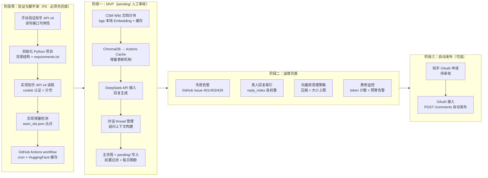

# 实施方案与计划

> 基于 `docs/调研/` 所有调研报告及 `docs/Review-方案/` 的评审意见（codex · claude · 2026-04-09），本文档给出详细实施方案、流程图及独立 Action Items。

---

## 零、评审意见摘要与计划调整说明

### 已纳入本次修订的主要问题

| # | 来源 | 风险等级 | 问题 | 本计划应对 |
|---|------|---------|------|-----------|
| 1 | codex + claude | 🔴 高 | Cookie 无法写评论，必须 OAuth | P0 优先实现 pending/ 人工审核模式；OAuth 作为后续阶段 |
| 2 | codex | 🟡 中 | BGE 模型每次拉取 ~400MB 易超时 | P1 加 HuggingFace Cache + 线上 embedding 兜底开关 |
| 3 | codex | 🟡 中 | 向量库全量 commit 长期膨胀 | P1 改存 Actions Cache；仓库只保留 hash/metadata |
| 4 | codex + claude | 🟡 中 | 评论暴增时缺少每日限额与费用告警 | P1 加每日总量上限 + LLM 预算阈值告警 |
| 5 | codex + claude | 🟡 中 | 发布失败/401/403/429 告警路径不明确 | P1 GitHub Issue 自动告警 |
| 6 | claude | 🟡 中 | Cookie 失效无感知 | P1 每次运行后记录 Cookie 状态；401/403 立即告警 |
| 7 | claude | 🟢 低 | 阶段时间节点过于乐观 | **里程碑改为功能验收而非时间节点** |
| 8 | claude | 🟢 低 | 边界情况未覆盖（超长/广告/重复/文章已删） | P1 统一在主流程做前置过滤 |

### 里程碑调整原则

> ⚡ **改为"功能验收驱动"，不设固定时间节点**，每个阶段以"验收标准全部通过"为推进条件。

---

## 一、系统逻辑流程图

```mermaid
flowchart TD
    A([GitHub Actions 定时触发\n每6小时]) --> B[拉取最新代码\n加载 seen_ids.json]
    B --> PRE{日处理量\n是否超限?}
    PRE -- 是 --> ALERT1[创建 GitHub Issue 告警\n当日已达上限]
    ALERT1 --> Z
    PRE -- 否 --> C{CSM Wiki\n是否有更新?}
    C -- 是 --> D[增量更新向量库\n只处理变更文件]
    C -- 否 --> E[跳过]
    D --> E
    E --> F[遍历监控文章列表\nconfig/articles.yaml]
    F --> G[调用知乎 API v4\nGET /articles/{id}/comments]
    G --> GERR{HTTP 状态}
    GERR -- 401/403 --> ALERT2[Cookie 失效\n创建 GitHub Issue 告警]
    ALERT2 --> Z
    GERR -- 429 --> RETRY[指数退避重试\n最多3次]
    RETRY --> GERR
    GERR -- 200 --> H{有新评论?}
    H -- 否 --> Z([本次结束\ngit push 状态])
    H -- 是 --> FILTER{前置过滤\n超长/广告/重复?}
    FILTER -- 跳过 --> H2[记录 skip 原因\n更新 seen_ids.json]
    H2 --> Z
    FILTER -- 通过 --> I{是追问?\n检查 parent_id}
    I -- 新对话 --> J[创建新 thread.md\n抓取文章摘要]
    I -- 追问 --> K[加载已有 thread.md\n获取历史上下文]
    J --> L[RAG 检索\n1. reply_index 真人回复\n2. CSM Wiki 相关片段]
    K --> L
    L --> M[组装 Prompt\nSystem: 角色+规则+Wiki\nHistory: 历史轮次\nUser: 当前评论]
    M --> N[调用 DeepSeek-V3 API\nmax_tokens=250]
    N --> O{OAuth Token\n是否可用?}
    O -- 否 --> P[写入 pending/\n等待人工确认]
    O -- 是 --> Q[调用知乎 API\nPOST /comments\n发布回复]
    Q --> QERR{发布结果}
    QERR -- 失败 --> P
    QERR -- 成功 --> R
    P --> R[追加到 thread.md\n更新 seen_ids.json]
    R --> S[真人是否有新回复?]
    S -- 是 --> T[写入 thread.md ⭐\n索引到 reply_index]
    S -- 否 --> U
    T --> U[git add + commit\n推送归档 skip-ci]
    U --> Z
```

---

## 二、实施流程图（功能验收驱动）



---

## 三、目录结构设计

```
Zhihu-CSM-Reply-Robot/
├── .github/workflows/
│   ├── bot.yml              # 主 workflow：每6小时检查回复
│   └── sync-wiki.yml        # 每周同步 CSM Wiki
├── config/
│   ├── articles.yaml        # 监控的知乎文章/问题列表
│   └── settings.yaml        # 全局配置（模型、k值、审核模式等）
├── scripts/
│   ├── run_bot.py           # 主入口
│   ├── zhihu_client.py      # 知乎 API 封装
│   ├── rag_retriever.py     # ChromaDB + BGE embedding
│   ├── llm_client.py        # DeepSeek/OpenAI 调用封装
│   ├── thread_manager.py    # 对话线程管理
│   ├── archiver.py          # 归档写入
│   └── wiki_sync.py         # CSM Wiki 增量同步
├── csm-wiki/                # CSM Wiki Markdown 文件（子模块或直接放置）
├── data/
│   ├── seen_ids.json
│   ├── wiki_hash.json
│   ├── vector_store/        # ChromaDB Wiki 索引
│   └── reply_index/         # ChromaDB 历史回复索引
├── archive/
│   └── articles/
│       └── {article_id}/
│           ├── meta.md
│           └── threads/
│               └── {thread_id}.md
├── pending/                 # 人工审核模式：待确认回复
├── requirements.txt
└── README.md
```

---

## 四、关键配置文件格式

### config/articles.yaml

```yaml
articles:
  - id: "98765432"
    title: "CSM 最佳实践系列（一）"
    url: "https://zhuanlan.zhihu.com/p/98765432"
    type: "article"   # article | question
  - id: "123456789"
    title: "如何做好客户成功？"
    url: "https://www.zhihu.com/question/123456789"
    type: "question"

settings:
  check_interval_hours: 6
  max_new_comments_per_run: 20      # 每次最多处理条数，防止异常
  max_new_comments_per_day: 100     # 每日上限（防止费用/风控异常）
  llm_budget_usd_per_day: 0.50     # 每日 LLM 费用预算上限，超出进 pending/
```

### config/settings.yaml

```yaml
llm:
  base_url: "https://api.deepseek.com"
  model: "deepseek-chat"
  fallback_model: "deepseek-reasoner"   # 复杂问题升级
  max_tokens: 250
  temperature: 0.7

rag:
  embedding_model: "BAAI/bge-small-zh-v1.5"  # 本地模型（需 HF 缓存）
  embedding_fallback: "text-embedding-3-small" # 线上兜底（可选，需 OPENAI_API_KEY）
  use_online_embedding: false              # true = 强制使用线上 embedding
  top_k: 3
  similarity_threshold: 0.72
  history_turns: 6   # 追问时保留最近N轮

vector_store:
  backend: "actions_cache"   # "git"（旧）| "actions_cache"（推荐）
  max_size_mb: 500            # 超出时触发清理/重建
  rebuild_interval_days: 30   # 定期重建向量库周期

review:
  manual_mode: true    # 默认 true（pending/ 模式）；OAuth 就绪后可改 false
  auto_skip_patterns:   # 跳过纯感谢类评论
    - "^谢谢[！!]?$"
    - "^感谢[！!]?$"

filter:
  max_comment_tokens: 500       # 超长截断阈值
  spam_keywords:                # 广告/违规关键词（跳过回复）
    - "加微信"
    - "私信"
  dedup_window_minutes: 60      # 同一用户N分钟内重复评论忽略

alerting:
  github_issue: true            # 401/403/429/预算超限时自动创建 Issue
  consecutive_fail_limit: 3     # 连续失败N次后暂停 workflow
```

---

## 五、独立 Action Items（功能验收驱动）

> ⚠️ **实施规范**：每个 Action Item 由 AI 实施时，**必须同步编写对应的测试用例**（`tests/` 目录，pytest 框架）。测试覆盖正常路径、边界条件和异常处理三类场景。

---

### P0 · 阶段零：验证与脚手架

---

#### AI-001：手动验证知乎 API v4 可用性

- **目标**：在正式开发前确认知乎 API 读写接口的当前可用状态
- **任务**：
  1. 用 curl/Postman 测试 `GET /api/v4/articles/{id}/comments`，记录响应格式
  2. 用 curl 测试 `POST /api/v4/articles/{id}/comments`，确认是否需要 OAuth（预期 401/403）
  3. 确认 OAuth 申请渠道（知乎开放平台）及审核周期
  4. 将测试结果更新至 `docs/调研/01-知乎数据获取.md`
- **验收**：文档中有实测的请求/响应示例，明确写操作是否可用及 OAuth 状态
- **测试**：无（手动验证步骤）

---

#### AI-002：项目初始化与目录脚手架

- **目标**：建立项目骨架，使后续模块可独立开发
- **任务**：
  1. 创建 `scripts/` 下各模块空文件（含 docstring 和类型注解骨架）
  2. 创建 `config/articles.yaml` 和 `config/settings.yaml`（含所有新增配置项）
  3. 创建 `requirements.txt`（openai>=1.0, chromadb, sentence-transformers, requests, pyyaml, python-frontmatter, tiktoken, pytest）
  4. 创建 `tests/` 目录和 `conftest.py`
  5. 创建 `.gitignore`（忽略 `data/vector_store/`、`data/reply_index/`、`.env`）
- **验收**：`python -m pytest tests/` 可执行（0 tests，无报错）
- **测试**：`tests/test_config.py` — 验证 yaml 配置文件可被正确加载，必填字段存在

---

#### AI-003：ZhihuClient — 读取接口

- **目标**：实现知乎评论读取，含认证、分页、限流
- **任务**：实现 `scripts/zhihu_client.py`
  1. `ZhihuClient(cookie)` 从 `ZHIHU_COOKIE` 环境变量读取
  2. `get_article_comments(article_id, since_id=None) -> list[Comment]`
     - 自动分页直到 `is_end=True`
     - 随机延迟 1~2 秒
     - 429 指数退避最多 3 次
  3. `dataclass Comment`：`id, parent_id, content, author, created_time, is_author_reply`
  4. Cookie 失效（401/403）时抛出 `ZhihuAuthError`
- **验收**：单元测试全部通过
- **测试**：`tests/test_zhihu_client.py`
  - Mock HTTP：正常分页返回、`is_end=True` 停止分页
  - Mock HTTP 429：验证指数退避重试逻辑
  - Mock HTTP 401：验证抛出 `ZhihuAuthError`
  - 验证 `Comment` dataclass 字段映射正确

---

#### AI-004：GitHub Actions Workflow 基础版

- **目标**：可运行的 workflow，含 HuggingFace 模型缓存
- **任务**：创建 `.github/workflows/bot.yml`
  1. 触发：`schedule cron '0 2,8,14,20 * * *'` + `workflow_dispatch`
  2. steps：checkout → setup-python 3.11 → **actions/cache（pip + huggingface）** → pip install → python run_bot.py → git commit+push
  3. 所需 secrets：`ZHIHU_COOKIE`, `LLM_API_KEY`, `LLM_BASE_URL`, `LLM_MODEL`, `GITHUB_TOKEN`
  4. `permissions: contents: write`
- **验收**：workflow 可手动触发，缓存 key 命中后跳过下载
- **测试**：`tests/test_workflow_config.py` — 解析 yaml，验证必要字段（cron、secrets 引用、permissions）存在

---

### P1 · 阶段一：MVP（pending/ 人工审核）

---

#### AI-005：RAGRetriever — Wiki 索引与检索

- **目标**：实现 CSM Wiki 增量 embedding + 检索
- **任务**：实现 `scripts/rag_retriever.py`
  1. 本地 BGE embedding（`BAAI/bge-small-zh-v1.5`），支持 `use_online_embedding` 开关切换为 `text-embedding-3-small`
  2. `sync_wiki(force=False)`：MD5 比对，增量更新，按标题分块
  3. `retrieve(query, k=3, threshold=0.72) -> list[str]`：先 reply_index top-2，再 wiki top-(k-2)
  4. `index_human_reply(question, reply, article_id, thread_id)`：高权重写入 reply_index
  5. 向量库路径从 settings 读取（`actions_cache` 模式时路径可配置）
- **验收**：单元测试全部通过
- **测试**：`tests/test_rag_retriever.py`
  - 用 Mock ChromaDB，测试 `sync_wiki` 只对变更文件重新 embedding
  - 测试 `retrieve` 相似度低于阈值时返回空
  - 测试 `retrieve` 优先返回 reply_index 中高权重结果
  - 测试 `use_online_embedding=true` 时调用正确的 embedding 接口

---

#### AI-006：LLMClient — 回复生成

- **目标**：实现 DeepSeek/OpenAI 调用，含 Prompt Caching 和费用追踪
- **任务**：实现 `scripts/llm_client.py`
  1. 从环境变量读取 `LLM_API_KEY`, `LLM_BASE_URL`, `LLM_MODEL`
  2. `generate_reply(comment, context_chunks, article_summary, history_messages=None) -> tuple[str, int]`
     - System Prompt（角色 + 规则 + wiki_context）作为固定前缀
     - 记录 `prompt_cache_hit_tokens`
  3. `summarize_article(title, content) -> str`（≤200 tokens，结果缓存）
  4. 指数退避重试最多 3 次
  5. 累计 token 费用，超 `llm_budget_usd_per_day` 时抛出 `BudgetExceededError`
- **验收**：单元测试全部通过
- **测试**：`tests/test_llm_client.py`
  - Mock OpenAI API：验证 System Prompt 前缀固定（缓存友好）
  - 验证 history_messages 正确拼接到 messages 列表
  - 验证重试逻辑（mock 前2次失败，第3次成功）
  - 验证超预算时抛出 `BudgetExceededError`
  - 验证 `summarize_article` 结果被缓存（第二次调用不触发 API）

---

#### AI-007：ThreadManager — 对话线程管理

- **目标**：实现线程文件的创建、读取和追加
- **任务**：实现 `scripts/thread_manager.py`
  1. `get_or_create_thread(article_id, root_comment, article_meta) -> Path`
  2. `append_turn(thread_path, author, content, is_human=False, model=None, tokens=None)`
     - `is_human=True` 时加 ⭐，更新 front-matter `human_replied=true`
  3. `build_context_messages(thread_path, max_turns=6) -> list[dict]`（OpenAI messages 格式）
- **验收**：单元测试全部通过
- **测试**：`tests/test_thread_manager.py`
  - 测试顶级评论新建 thread.md，追问复用已有 thread
  - 测试 `append_turn` 写入后 front-matter 可被 `python-frontmatter` 正确解析
  - 测试 `is_human=True` 时 ⭐ 标记存在
  - 测试 `build_context_messages` 超过 max_turns 时截断

---

#### AI-008：前置过滤器 — 边界情况处理

- **目标**：在主流程处理评论前过滤掉不需要回复的评论
- **任务**：实现 `scripts/comment_filter.py`
  1. `should_skip(comment, settings) -> tuple[bool, str]`（返回 `(是否跳过, 原因)`）
  2. 过滤规则：
     - 超长截断：评论 token 数 > `max_comment_tokens`（500）时截断，不跳过
     - 广告/敏感词：命中 `spam_keywords` 时跳过
     - 重复评论：同一 `author` 在 `dedup_window_minutes`（60分钟）内重复出现时跳过
     - 文章已删除/禁止评论（API 返回特定错误码）时跳过并记录
- **验收**：单元测试全部通过
- **测试**：`tests/test_comment_filter.py`
  - 测试超长评论被截断（不跳过）
  - 测试广告关键词命中时跳过
  - 测试 60 分钟内同一用户第二条评论被跳过
  - 测试正常评论不被过滤

---

#### AI-009：主流程 run_bot.py — MVP 版

- **目标**：串联所有模块，实现 pending/ 人工审核 MVP
- **任务**：实现 `scripts/run_bot.py`
  1. 加载配置，初始化所有模块
  2. 每日处理量检查（`max_new_comments_per_day`）
  3. 对每篇文章：拉取评论 → 前置过滤 → RAG → LLM → 写入 `pending/`
  4. 检测真人新回复，调用 `index_human_reply`
  5. `ZhihuAuthError` / `BudgetExceededError` 时创建 GitHub Issue 告警（使用 `GITHUB_TOKEN`）
  6. 退出前 git commit（若有变更）
- **验收**：端到端集成测试通过（全 mock 外部依赖）
- **测试**：`tests/test_run_bot.py`（集成测试）
  - Mock ZhihuClient 返回 2 条新评论，验证 pending/ 下生成 2 个文件
  - Mock ZhihuAuthError，验证创建了 GitHub Issue（mock GitHub API）
  - Mock BudgetExceededError，验证超额后跳过剩余评论并告警
  - 验证每日上限生效（第 101 条评论被跳过）

---

### P2 · 阶段二：运维完善

---

#### AI-010：告警模块 — GitHub Issue 自动创建

- **目标**：失败时自动创建 GitHub Issue，覆盖所有告警场景
- **任务**：实现 `scripts/alerting.py`
  1. `create_issue(title, body, labels)` — 调用 GitHub API（`GITHUB_TOKEN`）
  2. 告警场景：401/403（Cookie 失效）、429（持续限流）、连续失败 ≥ 3 次、每日预算超限
  3. 防重复：检查是否已有同 title 的 open issue，避免刷 issue
  4. 记录每次运行的 Cookie 存活状态到 `data/health.json`
- **验收**：单元测试全部通过
- **测试**：`tests/test_alerting.py`
  - Mock GitHub API：验证 Issue 标题和标签正确
  - 验证重复告警时不创建第二个 issue（幂等）
  - 验证 `health.json` 记录了 Cookie 状态

---

#### AI-011：向量库外部化 — Actions Cache 方案

- **目标**：将 vector_store/ 和 reply_index/ 从 git 移到 Actions Cache，防止仓库膨胀
- **任务**：
  1. 更新 `.gitignore`，排除 `data/vector_store/` 和 `data/reply_index/`
  2. 在 `bot.yml` 中添加 `actions/cache` 步骤，key 基于日期（每日更新）
  3. `RAGRetriever.sync_wiki()` 在 cache miss 时自动重建索引
  4. 添加每月重建任务（workflow_dispatch 手动触发 or schedule）
  5. 大小上限检查：超过 `max_size_mb`（500MB）时触发告警
- **验收**：PR 不含 vector_store/ 二进制文件；Actions Cache 命中时跳过重建
- **测试**：`tests/test_vector_store_cache.py`
  - 验证 cache miss 时调用重建逻辑
  - 验证大小超限时触发告警

---

#### AI-012：费用监控 — Token 计数与预算日报

- **目标**：记录每次运行费用，并在超预算时告警
- **任务**：
  1. `scripts/cost_tracker.py`：记录 `(timestamp, model, prompt_tokens, completion_tokens, cache_hit_tokens, usd_cost)` 到 `data/cost_log.jsonl`
  2. 每次运行结束时输出当日费用摘要（stdout）
  3. 超 `llm_budget_usd_per_day` 时调用 `alerting.create_issue`
  4. 月度汇总：按月累计写入 `data/cost_summary.json`
- **验收**：单元测试全部通过
- **测试**：`tests/test_cost_tracker.py`
  - 验证多次调用后 `cost_log.jsonl` 行数正确
  - 验证日费用累计计算正确
  - 验证超预算时调用告警（mock alerting）

---

#### AI-013：真人回复高权重索引

- **目标**：自动检测作者新回复并写入高权重索引，形成自学习闭环
- **任务**：
  1. 在主流程中扫描 `is_author_reply=True` 的新评论
  2. 找到对应 thread，提取 QA 对（用户问题 + 作者回复）
  3. 调用 `RAGRetriever.index_human_reply()`，标记 `weight=high`
  4. 在 thread.md 中加 ⭐ 标记
- **验收**：人工验证：添加真人回复后，类似问题的 RAG 检索优先返回该回复
- **测试**：`tests/test_human_reply_index.py`
  - Mock ChromaDB：验证 `weight=high` 元数据被正确写入
  - 验证 `retrieve` 时 reply_index 结果优先于 wiki 结果

---

### P3 · 阶段三：自动发布（可选，待 OAuth 审批）

---

#### AI-014：ZhihuClient — OAuth 写操作接入

- **目标**：在获得知乎 OAuth 授权后，实现评论自动发布
- **前提**：AI-001 确认 OAuth 申请通过，access_token 已配置为 secret
- **任务**：
  1. `ZhihuClient.post_comment(object_id, object_type, content, parent_id=None) -> bool`
     - 使用 `ZHIHU_OAUTH_TOKEN` 环境变量
     - 发布失败时写入 pending/ 并返回 False
  2. 刷新 token 逻辑（access_token 过期时用 refresh_token 获取新 token）
  3. 更新 `settings.yaml` 中 `manual_mode: false` 为默认值
- **验收**：单元测试全部通过；集成测试（沙盒文章）可实际发布评论
- **测试**：`tests/test_zhihu_post.py`
  - Mock HTTP POST 成功：验证返回 True
  - Mock HTTP POST 失败：验证写入 pending/ 并返回 False
  - Mock token 过期（401）：验证触发 token 刷新

---

## 六、AI 编程提示（Coding Prompts）

以下为各 Action Item 对应的 AI Coding Prompt，**按 Action Item 编号顺序执行**。每个 Prompt 都**必须包含"同步编写测试用例"的要求**。

---

### Prompt AI-002：项目初始化

```
请根据以下规格初始化 Python 项目 Zhihu-CSM-Reply-Robot：

目录结构：
- scripts/run_bot.py（主入口）
- scripts/zhihu_client.py
- scripts/rag_retriever.py
- scripts/llm_client.py
- scripts/thread_manager.py
- scripts/comment_filter.py
- scripts/archiver.py
- scripts/wiki_sync.py
- scripts/alerting.py
- scripts/cost_tracker.py
- config/articles.yaml（含示例配置，包含每日上限、预算字段）
- config/settings.yaml（含所有新增配置：vector_store.backend、filter、alerting 字段）
- requirements.txt（openai>=1.0, chromadb, sentence-transformers, requests, pyyaml, python-frontmatter, tiktoken, pytest）
- tests/conftest.py
- .gitignore（包含 data/vector_store/、data/reply_index/、.env）

所有模块使用 Python 3.11+，类型注解，遵循 dataclass 模式。
同步编写 tests/test_config.py，验证 yaml 配置可被加载，必填字段存在。
```

---

### Prompt AI-003：ZhihuClient 读取接口

```
实现 scripts/zhihu_client.py，要求：

1. 类 ZhihuClient(cookie: str)，从环境变量 ZHIHU_COOKIE 读取
2. 方法 get_article_comments(article_id, since_id=None) -> list[Comment]
   - 调用 GET https://www.zhihu.com/api/v4/articles/{id}/comments?limit=20&offset=0
   - 自动分页直到 is_end=True；请求间随机延迟 1~2 秒
   - 429 指数退避重试最多3次
3. dataclass Comment 字段：id, parent_id, content, author, created_time, is_author_reply
4. Cookie 失效（401/403）时抛出 ZhihuAuthError

同步编写 tests/test_zhihu_client.py，覆盖：
- 正常分页、is_end=True 停止
- 429 重试逻辑
- 401 抛出 ZhihuAuthError
- Comment 字段映射
```

---

### Prompt AI-005：RAGRetriever

```
实现 scripts/rag_retriever.py，要求：

1. 类 RAGRetriever(wiki_dir, vector_store_dir, reply_index_dir, use_online_embedding=False)
2. 本地 BAAI/bge-small-zh-v1.5；use_online_embedding=True 时改用 text-embedding-3-small
3. sync_wiki(force=False)：MD5 比对，增量更新，按 # 标题分块
4. retrieve(query, k=3, threshold=0.72) -> list[str]：reply_index top-2 优先
5. index_human_reply(question, reply, article_id, thread_id)：weight=high 写入

使用 ChromaDB PersistentClient。
同步编写 tests/test_rag_retriever.py，覆盖：
- sync_wiki 只处理变更文件（mock MD5 变化）
- retrieve 相似度阈值过滤
- index_human_reply 高权重元数据
- use_online_embedding 开关
```

---

### Prompt AI-006：LLMClient

```
实现 scripts/llm_client.py，要求：

1. 从环境变量读取 LLM_API_KEY, LLM_BASE_URL, LLM_MODEL
2. generate_reply(comment, context_chunks, article_summary, history_messages=None) -> tuple[str, int]
   - System Prompt 固定前缀（角色+规则+wiki_context），最大化缓存命中
   - 记录 prompt_cache_hit_tokens
3. summarize_article(title, content) -> str（结果缓存）
4. 指数退避重试最多3次
5. 累计费用，超 llm_budget_usd_per_day 时抛出 BudgetExceededError

同步编写 tests/test_llm_client.py，覆盖：
- System Prompt 前缀固定（缓存友好）
- history_messages 正确拼接
- 重试逻辑（前2次失败第3次成功）
- 超预算时 BudgetExceededError
- summarize_article 缓存（第二次不触发 API）
```

---

### Prompt AI-007：ThreadManager

```
实现 scripts/thread_manager.py，要求：

1. ThreadManager(archive_dir: str)
2. get_or_create_thread(article_id, root_comment, article_meta) -> Path
3. append_turn(thread_path, author, content, is_human=False, model=None, tokens=None)
   - is_human=True 加 ⭐，更新 human_replied=true
4. build_context_messages(thread_path, max_turns=6) -> list[dict]（OpenAI messages 格式）

使用 python-frontmatter 读写 YAML front-matter。
同步编写 tests/test_thread_manager.py，覆盖：
- 顶级评论新建 thread，追问复用
- append_turn 后 front-matter 可正确解析
- is_human=True 时 ⭐ 存在
- build_context_messages 超 max_turns 截断
```

---

### Prompt AI-008：CommentFilter

```
实现 scripts/comment_filter.py，要求：

1. should_skip(comment, settings) -> tuple[bool, str]
2. 规则：
   - 超长（>max_comment_tokens）：截断，不跳过
   - 广告关键词：跳过，返回原因
   - 重复（同一 author 在 dedup_window_minutes 内）：跳过
   - 文章已删除/禁止评论：跳过

同步编写 tests/test_comment_filter.py，覆盖：
- 超长截断（不跳过）
- 广告词命中跳过
- 60分钟内重复评论跳过
- 正常评论通过
```

---

### Prompt AI-009：主流程 run_bot.py MVP

```
实现 scripts/run_bot.py 主流程（pending/ 模式），要求：

1. 加载配置，初始化所有模块
2. 每日处理量检查（max_new_comments_per_day）
3. 对每篇文章：拉取 → CommentFilter → RAG → LLM → 写入 pending/
4. 检测真人新回复，调用 index_human_reply
5. ZhihuAuthError / BudgetExceededError 时创建 GitHub Issue 告警
6. 连续失败 ≥ consecutive_fail_limit 时暂停并告警
7. 退出前 git commit

同步编写 tests/test_run_bot.py（集成测试，全 mock 外部依赖），覆盖：
- 2条新评论 → pending/ 生成2个文件
- ZhihuAuthError → GitHub Issue 告警
- BudgetExceededError → 跳过剩余评论并告警
- 每日上限：第101条被跳过
```

---

## 七、验收标准

| Action Item | 功能 | 验收条件 |
|-------------|------|----------|
| AI-001 | 知乎 API 验证 | 文档有实测请求/响应示例，写操作可用性明确 |
| AI-002 | 项目脚手架 | `pytest tests/` 可执行，配置文件加载测试通过 |
| AI-003 | 评论检测 | 新评论在下次 Action 触发后被检测到；单元测试通过 |
| AI-004 | Actions Workflow | 手动触发成功；HuggingFace 缓存命中后跳过下载 |
| AI-005 | CSM Wiki RAG | 回复中引用相关 Wiki 内容；增量更新仅处理变更文件 |
| AI-006 | LLM 回复生成 | 回复质量符合规范；Prompt Cache 命中率 > 50% |
| AI-007 | 对话线程管理 | 追问回复引用了历史轮次，不重复解释 |
| AI-008 | 边界过滤 | 广告/超长/重复评论被正确过滤；单元测试通过 |
| AI-009 | MVP pending/ | 每条评论生成对应 pending/ 文件；集成测试通过 |
| AI-010 | 失败告警 | Cookie 失效时自动创建 GitHub Issue；幂等不刷 issue |
| AI-011 | 向量库外部化 | PR 不含二进制向量文件；仓库大小不随时间膨胀 |
| AI-012 | 费用监控 | 月度 LLM 费用 < $1（基准 300 条/月）；超预算时告警 |
| AI-013 | 真人回复索引 | 真人回复后，类似问题优先参考真人风格 |
| AI-014 | OAuth 自动发布 | OAuth 就绪后可切换 manual_mode=false 实现自动发布 |

